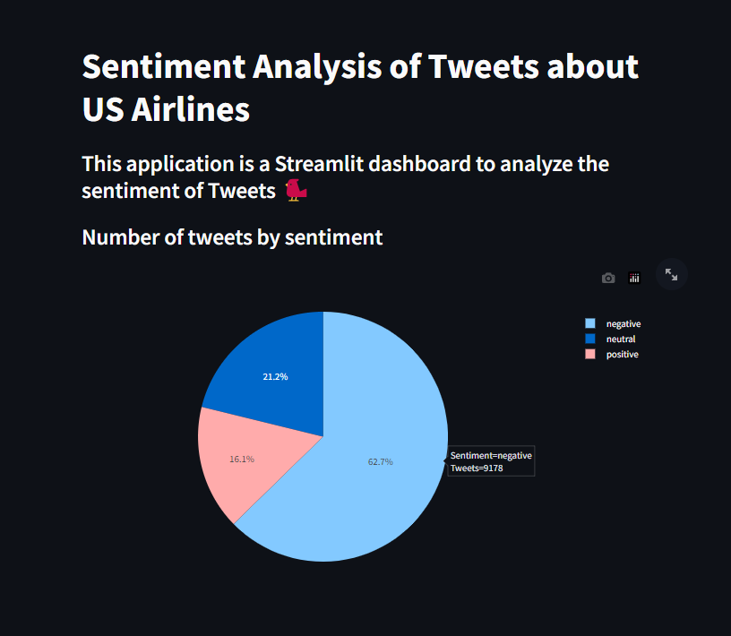

# Streamlit Airline Sentiment Dashboard

An interactive Streamlit dashboard for exploring sentiment in U.S. airline tweets. The app demonstrates how to combine data exploration, geospatial visualization, and natural language processing primitives (word clouds) in a maintainable, testable Streamlit project.



## Features
- **Sentiment overview**: Histogram or pie chart showing tweet volume by sentiment.
- **Geospatial view**: Plot tweet locations on a map with an hour-of-day filter for quick temporal exploration.
- **Airline breakdowns**: Compare sentiment distributions across specific airlines.
- **Word clouds**: Highlight common terms for positive, neutral, or negative tweets.
- **Reproducible setup**: Clear dependency list and lightweight tests to keep the project reliable.

## Quickstart
1. **Install dependencies**
   ```bash
   python -m venv .venv
   source .venv/bin/activate  # On Windows use .venv\\Scripts\\activate
   pip install -r requirements.txt
   ```

2. **Run the Streamlit app**
   ```bash
   streamlit run app.py --server.port 8502
   ```
   The dashboard will be available at http://localhost:8502. The map view demonstrates the tweet geolocations directly in the GitHub-hosted dataset (`streamlit-demo-data/Tweets.csv`).

3. **Run tests**
   ```bash
   pytest
   ```

## Project structure
```
.
├── app.py                     # Streamlit app with modular data/visual helpers
├── requirements.txt           # Project dependencies (app + tests)
├── streamlit-demo-data/
│   └── Tweets.csv             # Airline sentiment dataset with coordinates
└── pic/
    ├── example_1.png          # Dashboard preview (sentiment charts)
    └── example_2.png          # Additional visualization example
```

## Development tips
- The app logic is organized into small helper functions (data loading, filtering, word-cloud prep) to simplify testing and reuse.
- The `@st.cache_data` decorator ensures tweet data is only read once per session, keeping the dashboard responsive.
- Use the provided tests as a template for validating new data transformations or visual helpers.

## Deployment
You can deploy this project to [Streamlit Community Cloud](https://streamlit.io/cloud) or any environment that can run Streamlit apps. Set the working directory to the repository root and point the deployment command to `streamlit run app.py`.
